# Crypto Assistant Bot 🚀

A Telegram bot built with Python to help users track cryptocurrency news, set price alerts, manage portfolios, and simulate trades.

## Features 🌟

- `/start` - Start the bot and see available commands
- `/help` - Display help information
- `/news` - Get the latest cryptocurrency news
- `/alert` - Set up price alerts for specific cryptocurrencies

## Prerequisites 📋

Before running the bot, make sure you have:

- Python 3.8 or higher installed
- A Telegram account
- A bot token from [@BotFather](https://t.me/BotFather)

## Installation 🔧

1. Clone the repository:
```bash
git clone https://github.com/yourusername/cryptoBot.git
cd cryptoBot
```

2. Create a virtual environment (recommended):
```bash
python -m venv .venv
# On Windows
.venv\Scripts\activate
# On macOS/Linux
source .venv/bin/activate
```

3. Install required packages:
```bash
pip install python-telegram-bot python-dotenv
```

4. Set up your environment variables:
   - Create a `.env` file in the project root
   - Add your Telegram bot token:
     ```
     TELEGRAM_TOKEN=your_bot_token_here
     ```

## Running the Bot 🚀

1. Make sure your virtual environment is activated
2. Run the bot:
```bash
python bot.py
```

## Project Structure 📁

```
cryptoBot/
├── .env                # Environment variables (not in git)
├── .gitignore         # Git ignore file
├── LICENSE            # MIT License
├── README.md          # This file
├── bot.py
├── config.py
├── handlers.py
├── requirements.txt
├── setup_database.py
├── .vscode/
│   └── settings.json
├── Jobs/
│   ├── __init__.py
│   ├── alerts.py
│   ├── news.py
│   ├── portfolio.py
│   └── subscription_management.py
├── SubscriptionsBot/
│   ├── payment_gatways/
│   │   ├── nowpayments_Fiat_gateway.py
│   │   └── nowpayments_crypto_gateway.py
│   ├── Payment_handler.py
│   ├── Sbot.py
│   └── webhookserver.py
├── test/
│   ├── test_Sbot.py
│   ├── test_check_prices.py
│   ├── test_news.py
│   ├── test_news_2.py
│   ├── test_payment_handler.py
│   └── test_webhookserver.py
└── utils/
    ├── __init__.py
    ├── binance_api.py
    ├── helpers.py
    └── logging.py
```

## Contributing 🤝

Feel free to fork this project and submit pull requests. You can also open issues for bugs or feature requests.

## License 📄

This project is licensed under the MIT License - see the [LICENSE](LICENSE) file for details.

## Security Notes 🔒

- Never commit your `.env` file or share your bot token
- The bot currently runs in simulation mode and doesn't handle real cryptocurrency transactions
- Always verify transactions and double-check financial information

## Future Enhancements 🎯

- add volume and liquidity to alerts messages


## Project Architecture 🏗️



```mermaid
graph TB 
     subgraph "User Interface Layer" 
         TG[Telegram Users] 
         CH[Telegram Channel] 
     end 
 
     subgraph "Main Bot Service" 
         MB[Main Bot<br/>bot.py] 
         HAND[Handlers<br/>handlers.py] 
         CONFIG[Configuration<br/>config.py] 
         
         MB --> HAND 
         MB --> CONFIG 
     end 
 
     subgraph "Subscription Bot Service" 
         SB[Subscription Bot<br/>Sbot.py] 
         PH[Payment Handler<br/>Payment_handler.py] 
         WHS[Webhook Server<br/>webhookserver.py] 
         
         SB --> PH 
         WHS --> PH 
     end 
 
     subgraph "Scheduled Jobs" 
         ALERTS[Alerts Job<br/>check_prices] 
         NEWS[News Job<br/>news_job] 
         PORTFOLIO[Portfolio Job] 
         SUBSCHECK[Subscription Check<br/>check_expired] 
         REMINDER[Expiration Reminders] 
         
         SCH[APScheduler] 
         SCH --> ALERTS 
         SCH --> NEWS 
         SCH --> PORTFOLIO 
         SCH --> SUBSCHECK 
         SCH --> REMINDER 
     end 
 
     subgraph "Utilities & Helpers" 
         BINAPI[Binance API<br/>binance_api.py] 
         HELPERS[Helper Functions<br/>helpers.py] 
         LOGGER[Logging<br/>logging.py] 
     end 
 
     subgraph "External APIs" 
         BINANCE[Binance API<br/>Price Data] 
         RSS[RSS Feeds<br/>CoinDesk/CoinTelegraph/Decrypt] 
         NP[NOWPayments API<br/>Crypto Payments] 
     end 
 
     subgraph "Data Layer" 
         DB[(SQLite Database<br/>cryptoAssitantBot.db)] 
         
         subgraph "Database Tables" 
             T1[price_history] 
             T2[sent_alerts] 
             T3[watched_coins] 
             T4[processed_news] 
             T5[subscribers] 
             T6[payments] 
             T7[pending_payments] 
         end 
         
         DBSETUP[Database Setup<br/>setup_database.py] 
         DBSETUP --> DB 
         DB --> T1 
         DB --> T2 
         DB --> T3 
         DB --> T4 
         DB --> T5 
         DB --> T6 
         DB --> T7 
     end 
 
     subgraph "Payment Gateway" 
         PG[Payment Gateways<br/>TON/BEP20] 
         NP --> PG 
     end 
 
     %% User Interactions 
     TG -->|Commands| MB 
     TG -->|Subscription| SB 
     
     %% Main Bot Flow 
     MB -->|Schedule Jobs| SCH 
     HAND -->|/start /alerts<br/>/news /help| TG 
     
     %% Jobs Interactions 
     ALERTS -->|Check Prices| BINAPI 
     ALERTS -->|Send Alerts| CH 
     NEWS -->|Fetch News| RSS 
     NEWS -->|Send News| CH 
     SUBSCHECK -->|Check Expiry| DBSETUP 
     REMINDER -->|Send Reminders| TG 
     
     %% API Calls 
     BINAPI -->|Get Prices| BINANCE 
     NEWS -->|Parse RSS| RSS 
     PH -->|Create Payment| NP 
     WHS -->|Webhook| NP 
     
     %% Database Operations 
     ALERTS -->|Save/Query| DBSETUP 
     NEWS -->|Mark Processed| DBSETUP 
     MB -->|Manage Coins| DBSETUP 
     SB -->|Manage Subscribers| DBSETUP 
     PH -->|Save Payment| DBSETUP 
     
     %% Utilities Usage 
     ALERTS --> HELPERS 
     NEWS --> HELPERS 
     MB --> LOGGER 
     SB --> LOGGER 
     
     %% Payment Flow 
     SB -->|Request Payment| PH 
     PH -->|Process| PG 
     WHS -->|IPN Callback| DBSETUP 
     WHS -->|Activate| SB 
 
     style MB fill:#4A90E2 
     style SB fill:#E24A4A 
     style DB fill:#50C878 
     style SCH fill:#F5A623 
     style BINANCE fill:#F0B90B 
     style NP fill:#00D4FF 
     style CH fill:#0088CC
```

## Support 💬

If you need help or have questions, you can:
- Open an issue in this repository
- Contact the developer through Telegram
- Check the Telegram Bot API documentation
